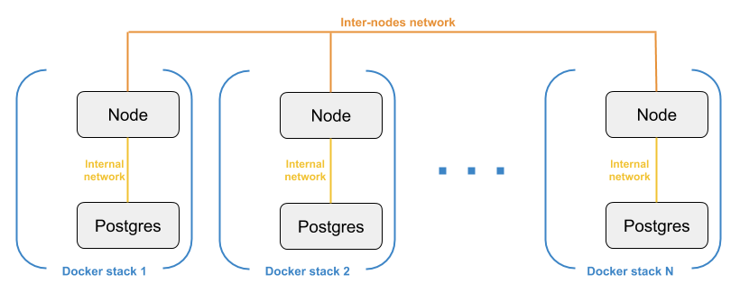

# Ark Core e2e Testing : Proof of Concept

## Introduction

Ark Core code is well-covered by unit tests, which is good to automatically identify bugs introduced by new code or refactoring.

But unit tests are limited to "simple" test cases. If we want to test how the Ark Core network behaves in the real-world, we need integration / end-to-end testing. This can be manual (devnet) or/and automated.

This Proof-of-Concept describes a possible solution to enable automated end-to-end testing.

## Architecture

### Docker

To be able to test the network in a real-world environment, we need to generate a number of nodes and make them interact with each other.

Here is a diagram showing how we leverage Docker *stacks* and user-defined *overlay networks* to have N independent nodes (each one has his own redis and postgres container) with a different IP assigned, interacting through standard ports (4000 / 4003), allowing to run a full network on one machine.

Now that we have defined this architecture, we need to provide a way to generate it and launch tests on it.

### NodeJS app

The NodeJS app takes care of : 

 - Generating and launching a network based on a user-defined configuration
 - Running a scenario (tests and actions) on the network

Here is the app structure :

- **/bin** : Entry point for command-line interface.
- **/lib** : App code
 - **/lib/config** : General configuration (currently only docker config).
 - **/tests/networks** : Networks configuration (genesis block, peers, ...). Each subfolder corresponds to a configured network.
 - **/tests/scenarios** : scenarios configuration (actions and tests to execute on the network). Each subfolder corresponds to a scenario.
 - **/dist** : Where the network is generated

There are two command-line endpoints :

 - `bin/e2e generate -n test1 -c 3` To generate a network with the configured network *test1* and 3 nodes.
 - `bin/e2e run-tests -n test1 -s scenario1` To run the configured *scenario1* on network *test1* .

#### Generating the network

So what is `bin/e2e generate -n test1 -c 3` really doing ?

It uses the *test1* configuration in **/tests/networks** to generate the network in the **/dist** folder : for each node wanted (here 3 nodes), it will clone the Core repository into a specific folder.

If we run the command, this is the structure we would get inside **/dist** :

 - **/dist/test1** : Root folder for generated network, contains shell scripts and nodes subfolders
 - **/dist/test1/node0** : Core repository with *test1* network configured and specific config for node0
 - **/dist/test1/node1** : same with config for node1
 - **/dist/test1/node2** : same with config for node2

Now to launch the network we would only need to :

    ./docker-init.sh && ./docker-start.sh

These scripts take care of docker configuring / building and launching the nodes (with docker stack deploy).

#### Running the scenario

`bin/e2e run-tests -n test1 -s scenario1` will inspect what you configured inside **/tests/scenarios/scenario1/config.js**. Here is an example :

    'use strict'
    
    module.exports = {
        events: {
            newBlock: {
                10: { tests: ['node/node.test.js', 'peers/peers.test.js'] },
                12: { actions: ['network/rm-stack-node1.js'] },
                17: { tests: ['peers/peers.test.js'] }
            }
        }
    }

 We are here defining some tests and actions to execute on specific blocks. The engine will pick this up and execute them when the block height matches.

Let's have a look at the test **node/node.test.js** (inside */tests/scenarios/scenario1/tests/*):

    'use strict'
    
    const utils = require('../../../utils')
    
    describe('API 2.0 - Node', () => {
      describe('GET /node/status', () => {
        it('should be alive', async () => {
          const response = await utils.request('GET', 'node/status')
          utils.expectSuccessful(response)
        })
      })
    })

Pretty straightforward 😀

The tests are executed with Jest using the Jest library (runCLI method), the results can be displayed or stored in a JSON file. 

### Travis

This could be integrated in a Travis workflow, for each commit or at a regular interval (every night for example).

## Recap : what have we done ?

We managed to automate end-to-end testing running a predefined scenario (actions and tests) on a generated network.

Right now, it is as simple as :

    bin/e2e generate -n test1 -c 3
    cd dist/test1 && ./docker-init.sh && ./docker-start.sh && cd ../..
    bin/e2e run-tests -n test1 -s scenario1

So we could integrate it in a Travis workflow.

## Going further

### Use multiple machines

This PoC runs the generated network on only 1 machine, but we could use Docker *Swarm* to allow distributing the generated nodes on multiple machines.

### End-to-end testing on wallets, explorer...

We could apply the same method to have end-to-end testing on related applications (desktop / mobile wallet, explorer...).

## Additional notes

### Decoupling network configuration and scenarios

I started with the idea that the network configuration should be independent from the tests and actions (so that we could choose one network and play any scenario on it). But going through I think it makes more sense to have them linked because test results can depend on network configuration (for example minimumNetworkReach).
